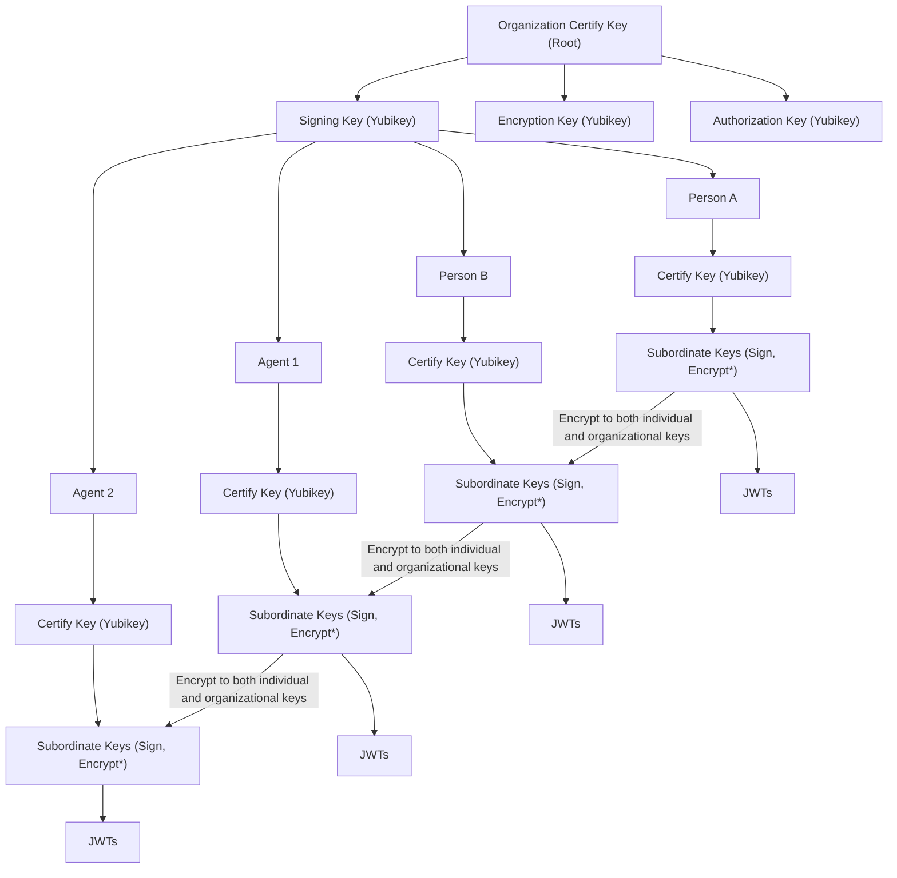

# Key Structure
We are building a set of Organizational Keys to manage encryption, signing, and authorization within the organization. The key formats used are GPG and ECC.

The encryption strategy ensures that the organization can decrypt any data encrypted by individuals. This is achieved by using the organization's encryption key alongside each individual's key for all encryption processes, guaranteeing that the organization retains decryption capabilities.

Signing and Authorization keys for both the organization and individuals are subordinate to the organization's Certify Key. These keys are also subject to revocation, providing the organization with control over the validity and usage of subordinate keys.

Messaging uses JWTs which are managed in NATS and are subordinate to the individual's keys.

### Key Hierarchy

#### 1. **Organization Level (Root)**
   - **Certify Key (Master/Root Key)**:  
     - Held offline... **NOT ON THE YUBIKEY**, this is a non-expiring, non-revocable key, it is ONLY used to generate other keys.
     - Used to certify **Subordinate Keys** for both the organization and individuals.
     - Responsible for certifying newly issued or replacement keys for the organization or individuals.
     - If this key is ever used in a live environment, red flags and alarms should go off.

   - **Subordinate Keys Derived from Certify Key**:
     - **Signing Key** (held on Yubikey):
       - Used by the organization to sign documents, software, etc.
       - Publicly distributed to verify authenticity.
     - **Encryption Key** (held on Yubikey):
       - Used for encrypting communication and data.
       - The organization's encryption key must also be used for any data encrypted by an individual to ensure organizational decryption capability.
     - **Authorization Key** (held on Yubikey):
       - Used for access control, including authenticating into secure systems like **Vaultwarden**.

   - **Live Public Keys Storage**:
     - All public keys generated at the organization level are maintained in a centralized, read-only location accessible to authorized personnel.
     - A clear **Revocation Policy** is defined and linked to the **Certify Key** to revoke individual or organization public keys.

#### 2. **Individual Level (Agents/People)**
   - Each individual, including agents, is subordinate to the organization, and derives their keys from the organization's **Certify Key**:

   - **Certify Key for Individuals**:
     - Derived from the **Organization Certify Key**.
     - Held securely on a Yubikey.
     - Used to certify subordinate keys specific to the individual.

   - **Subordinate Keys for Individuals**:
     - **Signing Key**:
       - Used to sign documents, communications, etc.
       - Subordinate to the organization's certify key, allowing organizational control over signature verification.
     - **Encryption Key (Modified Structure)**:
       - Individual encryption keys are subordinate to the organization's certify key.
       - **Encryption Policy**: All data encrypted by an individual must also be encrypted using the organization's public encryption key in addition to their own. This ensures that both the individual and the organization can decrypt the data.
     - **Authorization Key**:
       - Used for authentication for systems access.
       - Subordinate to the organization's certify key.

   - **Limited Lifetime Subkeys**:
     - Subkeys with limited validity are generated to minimize the risk of exposure.
     - These subkeys are refreshed periodically or upon key compromise.

#### **JWTs**
NATS (our messaging system) uses JSON Web Tokens (JWTs) to manage authentication and authorization for secure access control in a distributed environment. Here's how it works:

1. **Identity Management**:
   - JWTs in NATS are used to identify users, accounts, or services interacting with the NATS system.
   - Each entity (user, service, account) has a JWT issued by a trusted authority. The JWT contains claims specifying permissions, such as publish or subscribe rights, to certain subjects in the system.

2. **JWT Components**:
- JWTs in NATS include important claims like:
  - **Issuer**: Identifies who issued the token.
  - **Subject**: Identifies who or what the token is for.
  - **Permissions**: Specifies the subjects that the token holder can publish to or subscribe to.
  - **Expiration**: Sets a valid timeframe for the token.
  
1. **Signing and Verification**:
   - JWTs are signed using private keys of an Account Signing Key (ASK). This ensures the integrity of the JWT so it cannot be altered.
   - The NATS server verifies JWTs using the public key of the issuer, validating the authenticity and claims of the token.

2. **Account-Based Isolation**:
   - JWTs in NATS are used within **accounts**, which provide logical isolation between different groups of users or services.
   - An **account** in NATS defines a group of entities that share permissions and controls, and JWTs help enforce those boundaries by specifying which account a user or service belongs to and what privileges they have.

3. **Authorization Flow**:
   - When a client connects to the NATS server, it presents a JWT to authenticate itself.
   - The server checks the JWT signature, its validity (expiration, issuer, etc.), and the claims within it to determine whether the client is authorized to perform specific actions (e.g., publish to a topic).

4. **Public Key Infrastructure (PKI)**:
   - NATS builds its security on public-key cryptography. Each entity (account, user) has a key pair, and the JWT carries the public key along with claims. The JWT itself is signed by the issuer's private key.

5. **Revocation**:
   - If access needs to be revoked, the issuer can revoke a JWT by either marking it as revoked in a **central registry** or issuing a new JWT that supersedes the previous one.
  
NATS's use of JWTs helps to provide a secure and scalable method of managing access, ensuring entities are authenticated, and enforcing permissions in a distributed, multi-account system.

#### **Key Lifecycle Management Process**
   - **Creation and Transfer**:
     - Private keys are generated in an isolated, secure environment.
     - Once generated, they are transferred to Yubikeys and are never exported or backed up.

   - **Encryption and Decryption Process**:
     - Individuals must use both their own **encryption key** and the **organization's public encryption key** when encrypting data.
     - This ensures that the organization can decrypt any data if needed, using its own private key.

   - **Revocation Process**:
     - Individuals' keys are subordinate to the organization, allowing the organization to revoke any individual's keys using the **Certify Key**.
     - This can be useful if an individual leaves or if a key compromise is suspected.
     - Revoked keys are propagated to any relevant systems or services, including **Vaultwarden**.

#### 4. **Storage and Access Control**
   - **Vaultwarden Integration**:
     - Root keys (authorization keys) are used to securely log into **Vaultwarden**.
     - **Vaultwarden** stores passkeys associated with keys and other critical access information.
     - Individuals have specific access based on their roles, managed via **Authorization Keys**.

### Key Chart:

